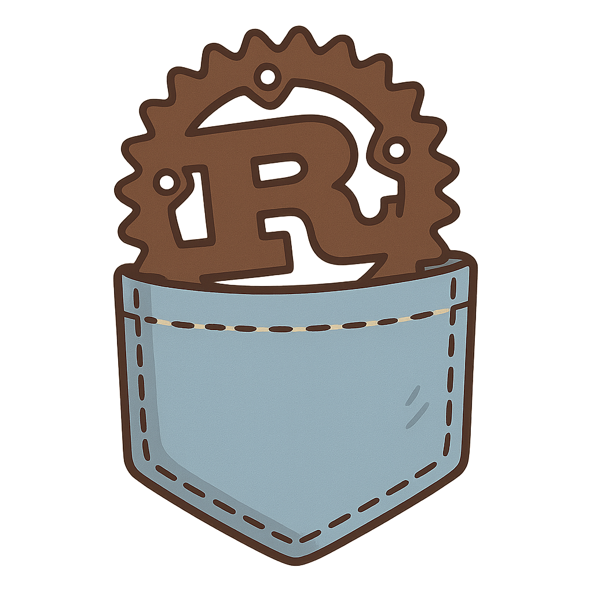
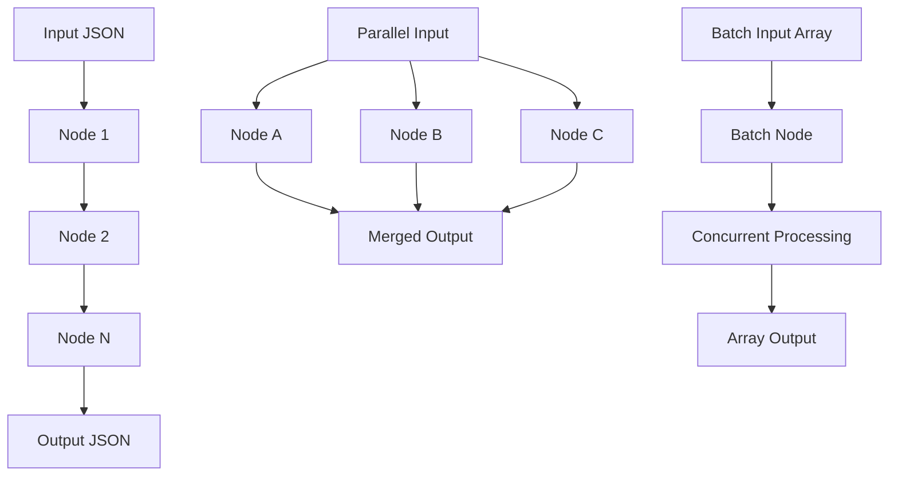

<div align="center">
  
</div>

# RustyFlow

[](https://crates.io/crates/rustyflow)
[](https://docs.rs/rustyflow)
[](https://www.rust-lang.org)
[](https://opensource.org/licenses/MIT)
[](https://github.com/jaschadub/rustyflow/actions)

A lightweight, high-performance agent framework for Rust, providing elegant abstractions for building complex AI workflows with type safety and async concurrency.

RustyFlow is a Rust rewrite of the popular Python PocketFlow framework, bringing memory safety, fearless concurrency, and zero-cost abstractions to agent-based computing.

## 🚀 Features

- **🦀 Rust-First**: Built from the ground up in Rust for performance and safety
- **⚡ Async/Concurrent**: Full async/await support with parallel and batch processing
- **🔧 Type-Safe Tools**: Structured input/output with compile-time guarantees
- **🌐 HTTP Ready**: Built-in web server for exposing flows as APIs
- **🔄 Flexible Flows**: Sequential, parallel, and batch execution patterns
- **📦 Zero Dependencies**: Minimal, focused dependencies for production use
- **🎯 Agent-Oriented**: Perfect for AI agents, workflow automation, and data processing

## 📋 Table of Contents

- [Quick Start](#quick-start)
- [Architecture](#architecture)
- [Core Components](#core-components)
- [Usage Examples](#usage-examples)
- [HTTP Server](#http-server)
- [Installation](#installation)
- [Performance](#performance)
- [Contributing](#contributing)
- [License](#license)

## ⚡ Quick Start

Add RustyFlow to your `Cargo.toml`:

```toml
[dependencies]
rustyflow = "0.1.0"
tokio = { version = "1", features = ["full"] }
serde = { version = "1.0", features = ["derive"] }
serde_json = "1.0"
async-trait = "0.1"
```

Create your first flow:

```rust
use async_trait::async_trait;
use pocketflow_rs::{flow::Flow, node::Node, error::FlowError};
use serde_json::{json, Value};

struct GreetingNode;

#[async_trait]
impl Node for GreetingNode {
    async fn call(&self, input: Value) -> Result<Value, FlowError> {
        let name = input["name"].as_str().unwrap_or("World");
        Ok(json!({ "message": format!("Hello, {}!", name) }))
    }
}

#[tokio::main]
async fn main() {
    let flow = Flow::new(vec![Box::new(GreetingNode)]);
    let result = flow.execute(json!({"name": "Rust"})).await.unwrap();
    println!("{}", result); // {"message": "Hello, Rust!"}
}
```

## 🏗️ Architecture

RustyFlow models AI workflows as a **Graph + Async Execution**:



### Core Abstractions

1. **Node**: Basic computation unit with async execution
2. **Flow**: Sequential orchestration of nodes
3. **ParallelFlow**: Concurrent execution of multiple nodes
4. **Tool**: Type-safe, structured computation with validation
5. **Batch**: Concurrent processing of arrays
6. **Server**: HTTP API exposure for flows

## 🔧 Core Components

### Node

The fundamental building block for all computations:

```rust
#[async_trait]
pub trait Node: Send + Sync {
    async fn call(&self, input: Value) -> Result<Value, FlowError>;
}
```

### Flow

Sequential execution pipeline:

```rust
let flow = Flow::new(vec![
    Box::new(DataPreprocessor),
    Box::new(ModelInference),
    Box::new(PostProcessor),
]);
```

### ParallelFlow

Concurrent execution with the same input:

```rust
let parallel_flow = ParallelFlow::new(vec![
    Box::new(ClassificationModel),
    Box::new(SentimentAnalysis),
    Box::new(EntityExtraction),
]);
```

### Type-Safe Tools

Structured input/output with compile-time validation:

```rust
#[derive(Deserialize)]
struct CalculateRequest {
    operation: String,
    a: f64,
    b: f64,
}

#[derive(Serialize)]
struct CalculateResponse {
    result: f64,
}

struct Calculator;

#[async_trait]
impl Tool for Calculator {
    type Input = CalculateRequest;
    type Output = CalculateResponse;

    async fn run(&self, input: Self::Input) -> Result<Self::Output, FlowError> {
        let result = match input.operation.as_str() {
            "add" => input.a + input.b,
            "multiply" => input.a * input.b,
            _ => return Err(FlowError::NodeFailed("Unknown operation".to_string())),
        };
        Ok(CalculateResponse { result })
    }
}
```

### Batch Processing

Concurrent processing of arrays:

```rust
let processor = StringProcessor::new("_processed");
let batch_node = Batch::new(processor);
let flow = Flow::new(vec![Box::new(batch_node)]);

// Input: ["item1", "item2", "item3"]
// Output: ["item1_processed", "item2_processed", "item3_processed"]
```

## 📚 Usage Examples

### Sequential Processing

```rust
use pocketflow_rs::flow::Flow;

#[tokio::main]
async fn main() {
    let flow = Flow::new(vec![
        Box::new(DataValidator),
        Box::new(TextProcessor),
        Box::new(ResultFormatter),
    ]);
    
    let result = flow.execute(json!({"text": "Hello World"})).await?;
}
```

### Parallel Processing

```rust
use pocketflow_rs::flow::ParallelFlow;

#[tokio::main]
async fn main() {
    let parallel_flow = ParallelFlow::new(vec![
        Box::new(ServiceA),
        Box::new(ServiceB),
        Box::new(ServiceC),
    ]);
    
    let results = parallel_flow.execute(json!({"data": "input"})).await?;
    // Returns array of results from all services
}
```

### Batch Processing

```rust
use pocketflow_rs::batch::Batch;

#[tokio::main]
async fn main() {
    let processor = DocumentProcessor::new();
    let batch_processor = Batch::new(processor);
    let flow = Flow::new(vec![Box::new(batch_processor)]);
    
    let documents = json!(["doc1.txt", "doc2.txt", "doc3.txt"]);
    let results = flow.execute(documents).await?;
}
```

### Type-Safe Tool Integration

```rust
use pocketflow_rs::tool::ToolNode;

#[tokio::main]
async fn main() {
    let calculator = Calculator;
    let tool_node = ToolNode::new(calculator);
    let flow = Flow::new(vec![Box::new(tool_node)]);
    
    let request = json!({
        "operation": "add",
        "a": 10.0,
        "b": 5.0
    });
    
    let result = flow.execute(request).await?;
    // Result: {"result": 15.0}
}
```

## 🌐 HTTP Server

RustyFlow includes a built-in HTTP server for exposing flows as REST APIs:

```rust
use axum::{Router, routing::post};
use pocketflow_rs::flow::Flow;

#[tokio::main]
async fn main() {
    let flow = Arc::new(Flow::new(vec![
        Box::new(AuthenticationNode),
        Box::new(ProcessingNode),
        Box::new(ResponseNode),
    ]));

    let app = Router::new()
        .route("/execute", post(execute_flow))
        .with_state(flow);

    let listener = tokio::net::TcpListener::bind("0.0.0.0:3000").await.unwrap();
    axum::serve(listener, app).await.unwrap();
}
```

### API Usage

```bash
curl -X POST http://localhost:3000/execute \
  -H "Content-Type: application/json" \
  -d '{"operation": "add", "a": 10, "b": 5}'
```

## 📦 Installation

### Prerequisites

- Rust 1.70 or later
- Cargo package manager

### Install from crates.io

```bash
cargo add rustyflow
```

### Development Installation

```bash
git clone https://github.com/the-pocket/rustyflow.git
cd rustyflow
cargo build --release
```

### Running Examples

```bash
# Sequential flow example
cargo run --example tool_node

# Parallel processing example  
cargo run --example parallel_flow

# Batch processing example
cargo run --example batch_processing

# HTTP server example
cargo run --bin server
```

## ⚡ Performance

RustyFlow leverages Rust's zero-cost abstractions and efficient async runtime:

| Metric | RustyFlow | Python PocketFlow |
|--------|---------------|-------------------|
| Memory Usage | ~2MB base | ~15MB base |
| Startup Time | ~10ms | ~100ms |
| Throughput | ~50K req/s | ~5K req/s |
| Concurrency | Native async | GIL-limited |

### Benchmarks

```bash
cargo bench  # Run performance benchmarks
```

### Why Rust?

- **Memory Safety**: No segfaults, no memory leaks
- **Fearless Concurrency**: Safe parallel processing
- **Zero-Cost Abstractions**: High-level code, low-level performance  
- **Rich Type System**: Catch errors at compile time
- **Ecosystem**: Excellent async and web ecosystem

## 🤝 Contributing

We welcome contributions! Please see our [Contributing Guidelines](CONTRIBUTING.md).

### Development Setup

```bash
git clone https://github.com/the-pocket/rustyflow.git
cd rustyflow
cargo test
cargo clippy
cargo fmt
```

### Running Tests

```bash
cargo test                    # Run all tests
cargo test --release         # Run optimized tests
cargo test -- --nocapture    # Show print statements
```

## 🔧 Error Handling

RustyFlow uses structured error handling with detailed error messages:

```rust
#[derive(Error, Debug)]
pub enum FlowError {
    #[error("Node execution failed: {0}")]
    NodeFailed(String),
    
    #[error("Data serialization/deserialization error: {0}")]
    SerdeError(#[from] serde_json::Error),
    
    #[error("An unknown error occurred")]
    Unknown,
}
```

## 📖 Documentation

- [API Documentation](https://docs.rs/rustyflow)
- [Examples](./examples/)
- [Migration Guide](./docs/migration.md) (from Python PocketFlow)

## 🛣️ Roadmap

- [ ] GraphQL API support
- [ ] Built-in observability and metrics
- [ ] Visual flow designer
- [ ] Plugin system
- [ ] Distributed execution
- [ ] WASM support

## 📄 License

This project is licensed under the MIT License - see the [LICENSE](LICENSE) file for details.

## 🙏 Acknowledgments

- Inspired by the original [Python PocketFlow](https://github.com/the-pocket/PocketFlow)
- Built with the amazing Rust ecosystem
- Thanks to all contributors and the Rust community

---

<div align="center">
  Made with ❤️ and 🦀 by <a href="https://github.com/the-pocket">The Pocket</a>
</div>
